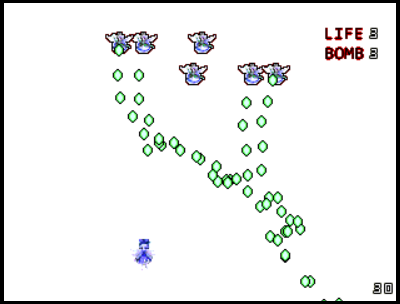

# Adventure-of-Cirno

This is a Touhou Project doujin game for Ti-nspire calculators.

To run this game on your Ti-nspire calculator,you need first install Ndless on it.
 
*This game is unfinished,and there is only ONE stage in this game.*

### How to build the project?
+ For Ti-nspire calculators,you need ndless-sdk and nSDL.
  Make sure there is a macro definition "#define CALC" at the beginning of the file "game.cpp". 
  Then simply use the Makefile provided.

+ For PCs,you need SDL 1.2.
  Make sure there is a macro definition "#define PC" at the beginning of the file "game.cpp". 
  Then add "-lmingw32 -lSDLmain -lSDL" to your build option.

### key controls
+ Calculator:
  key|funcion
  -|-
  LSHIFT|bmob
  TAB   | slow mode

  *Autoshoot always enabled on the calculator mode,
   you don't need to press any key to shoot. 
+ PC:
  key|function|
  -|-
  Z|shoot
  X|bmob
  LSHIFT|slow mode

+ Common

  key|funcion
  -|-
  Arrow Keys/ NUMPAD 8246|move
  LCTRL|skip dialog
  Q|exit
  R|restart
  G|speed up(debug mode)
